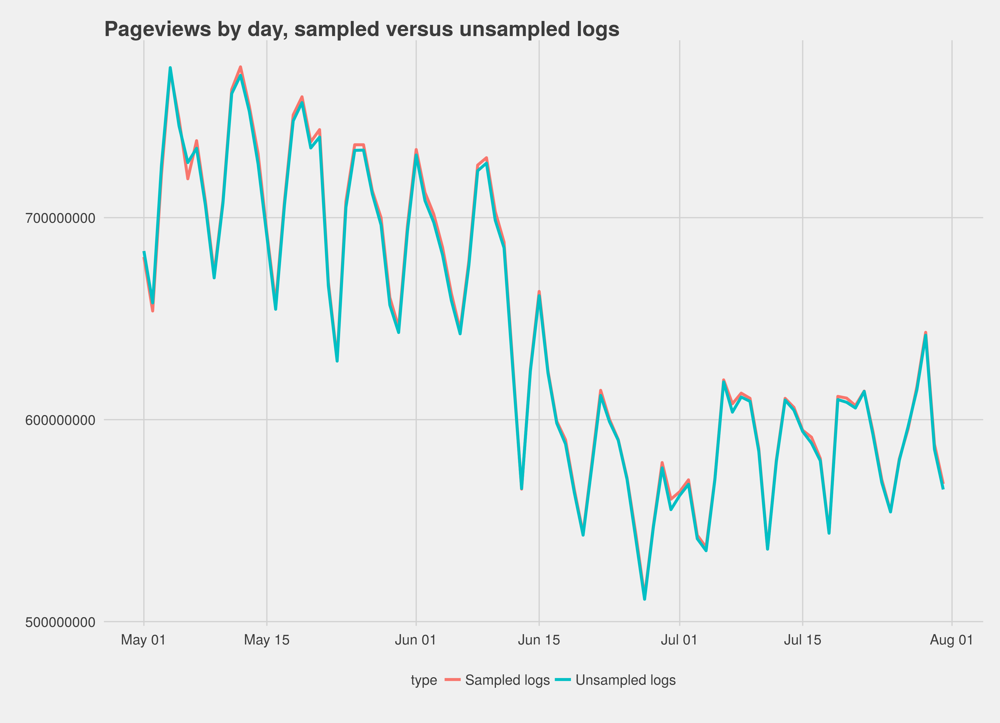
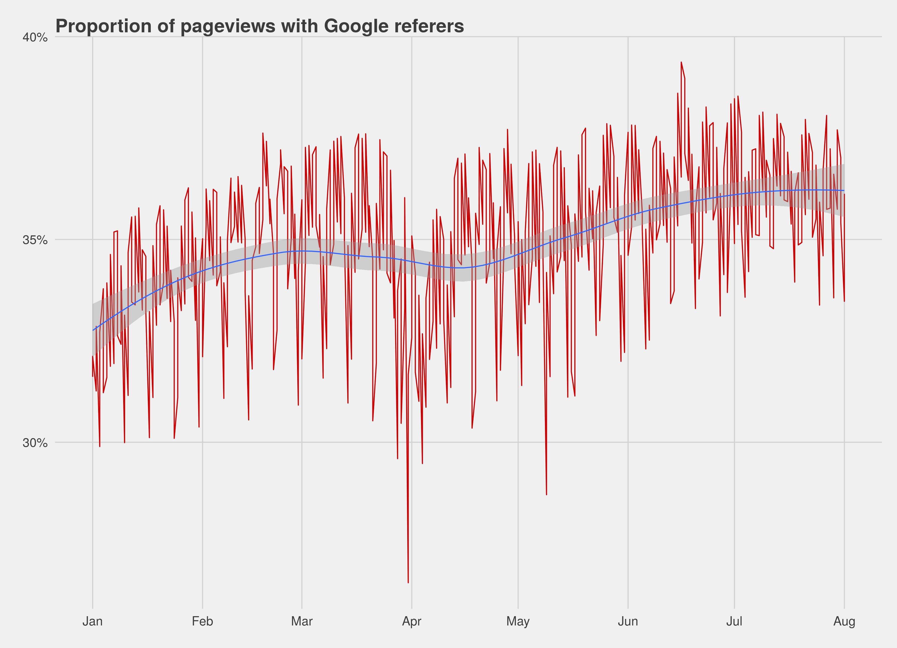
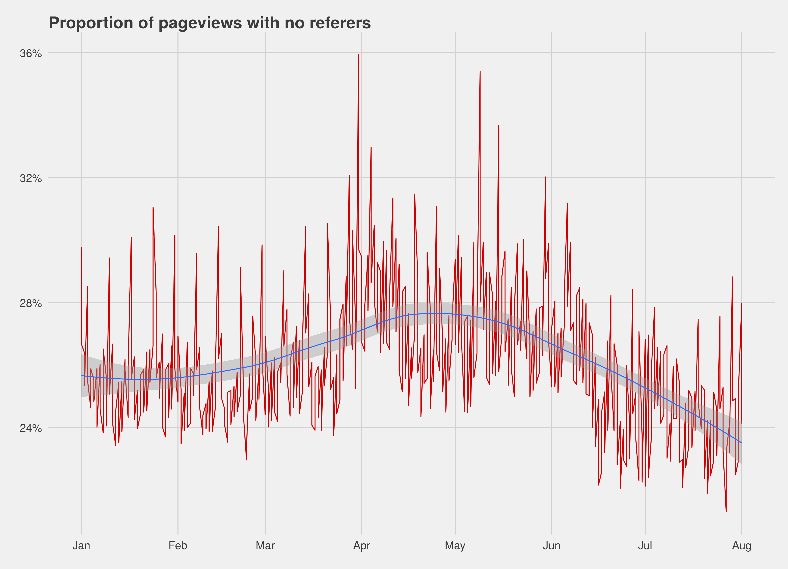

---
references:
- id: biedwards
  title: Wikipedia suddenly lost a massive amount of traffic from Google
  author:
  - family: Edwards
    given: Jim
  URL: 'http://www.businessinsider.com/wikipedia-sees-traffic-from-google-decline-2015-8'
  publisher: Business Insider
  type: article-journal
  issued:
    year: 2015
- id: wmfoliver
  title: R Code for Wikimedia Foundation Internal Usage
  author:
  - family: Keyes
    given: Oliver
  URL: 'https://github.com/Ironholds/wmf'
  publisher: Wikimedia Foundation
  type: article-journal
  issued:
    year: 2015
---

*Summary* no direct data shows a decrease in Google traffic; in fact, direct referrals from Google have been increasing in the last
few months, rather than decreasing. However, we have some fuzziness around indirect referrals that cannot be resolved without the participation of Google. We should seek that participation, and work on tracking these metrics in an automated fashion.

# Background

A news article based on a report from SimilarWeb stated that:

> Wikipedia lost an insane amount of traffic in the past 3 months. And by insane I mean that the free encyclopedia site lost more than 250 million desktop visits in just 3 months! [@biedwards]

The hypothesis as to how this drop came about is that Google began prioritising their own, or other, sources of information, and that the traffic drop comes from a reduction in visits from Google. We were tasked with investigating this drop and understanding if we could see any reduction in traffic from the data stored by the Wikimedia Foundation's servers.

# Methodology

While we do not track "visits", we do track pageviews, and whether those pageviews have referers. By investigating the proportion of pageviews that come with Google referers and identifying whether it has reduced over time we can go some way towards confirming or rejecting the idea that Google has been impeding our traffic.

One factor worth including, however, is that some HTTPS connections deliberately do not serve any form of referer data - meaning that a decline in Google-sourced pageviews could show itself not as a decline in pageviews from *Google*, but a decline in pageviews from *nobody*. Accordingly we will investigate both the rate at which google-sourced traffic comes in, and the rate at which nul-sourced traffic comes in.

Due to privacy and performance restrictions around the request logs, the period we need to cover (January-August 2015) is not available unsampled. Instead we must rely on the sampled logs, parsing them with our internal R framework for reading and validating this data.[@wmfoliver] This introduces some risks - our parsing methodology might be different or the simple variation in values between
sampled and unsampled data could introduce inaccuracies. Our best bet is to grab a chunk of the unsampled logs that we *do* have and
compare the pageviews counts to validate that relying on unsampled logs is not reducing accuracy.

The methodology, therefore, is:

1. For each day in January through to August 01 2015, read in the sampled logs;
2. Identify the number of pageviews, the number of pageviews with no referer, and the number of pageviews with a Google referer;
3. Calculate the proportions;
4. Compare the resulting dataset to a period from the unsampled logs to check for bias.

# Results

Comparing the unsampled and sampled logs (Fig. 1) revealed no substantial difference in the number of pageviews identified in each
dataset, which means the sampled logs can probably be relied on to answer our questions.

Looking at the proportion of pageviews with Google referers (Fig. 2) we see no decrease in pageviews with Google referers. In fact,
based on the localised smoothing represented by the blue line, Google refers are actually trending *up* over the last couple of months.

The proportion of pageviews with no referer whatsoever, however (Fig. 3) is trending down. This could indicate a multitude of things, including Google passing more referers through (which would explain the rise in the proportion of traffic we can trace to Google) - but it could also indicate that a chunk of our traffic, with no referer, *has* been decreasing - which could concievably be Google-sourced.

# Conclusion

Based on the data we have we can establish that the most obvious avenues for verifying or dismissing SimilarWeb's claim show no evidence that Google traffic has declined. However, we do not have the data at our end to eliminate *all* avenues of possibility.

Our next work should be to reach out to Google themselves and talk to them about the data we're seeing, and to build out infrastructure
to begin tracking metrics like this on a consistent and automated basis, rather than relying on costly ad-hoc analysis.

# Footnotes

